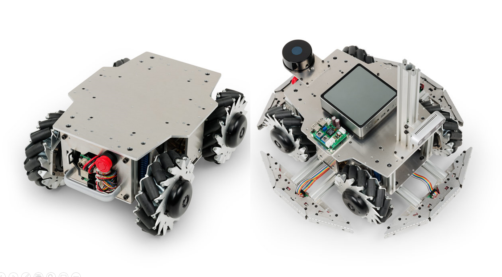

# メカナムローバーVer.3.0 ROS2パッケージ

<p align="center">
  
</p>

ヴイストン株式会社より発売されている全方向移動台車「[メカナムローバーVer.3.0](https://www.vstone.co.jp/products/wheelrobot/ver.3.0_mecanum.html)」をROS 2で制御するためのパッケージです。別途Linux搭載のPC及びロボット実機が必要になります。

# 目次
<!-- TOC -->

- [概要](#%E6%A6%82%E8%A6%81)
- [必要機器 & 開発環境](#%E5%BF%85%E8%A6%81%E6%A9%9F%E5%99%A8--%E9%96%8B%E7%99%BA%E7%92%B0%E5%A2%83)
- [パッケージ構成](#%E3%83%91%E3%83%83%E3%82%B1%E3%83%BC%E3%82%B8%E6%A7%8B%E6%88%90)
- [インストール方法](#%E3%82%A4%E3%83%B3%E3%82%B9%E3%83%88%E3%83%BC%E3%83%AB%E6%96%B9%E6%B3%95)
- [使用方法](#%E4%BD%BF%E7%94%A8%E6%96%B9%E6%B3%95)
- [ライセンス](#%E3%83%A9%E3%82%A4%E3%82%BB%E3%83%B3%E3%82%B9)
- [貢献](#%E8%B2%A2%E7%8C%AE)

<!-- /TOC -->

## 概要

メカナムローバーは、前後・左右・回転を組み合わせた自由度の高い移動ができることが大きな特徴で、細かい位置制御が求められる搬送・自律移動などの研究開発プロジェクトに好適です。このパッケージでは、メカナムローバーの制御を実現するためのROS2関連の機能を提供します。

## 必要機器 & 開発環境
- メカナムローバーVer.3.0:
  - 製品ページ: [https://www.vstone.co.jp/products/wheelrobot/ver.3.0_mecanum.html](https://www.vstone.co.jp/products/wheelrobot/ver.3.0_mecanum.html)
  - 販売ページ: [https://www.vstone.co.jp/robotshop/index.php?main_page=product_info&products_id=5345](https://www.vstone.co.jp/robotshop/index.php?main_page=product_info&products_id=5345)
- Ubuntu Linux - Jammy Jellyfish (22.04)
- ROS 2 Humble Hawksbill

## パッケージ構成
- `mecanumrover3`: メカナムローバーVer.3.0のメタパッケージ。
- `mecanumrover3_bringup`: メカナムローバーVer.3.0の起動に関連するノードやlaunchファイルを提供します。
- `mecanumrover_description`: メカナムローバーVer.3.0の物理モデルやURDFモデルを含んでいるパッケージです。

## インストール方法

このパッケージをインストールするには、以下の手順に従ってください。

1. [こちら](https://docs.ros.org/en/humble/Installation.html)の手順に従って、ROS 2 Humbleをインストールしてください。
2. このリポジトリをワークスペースにクローンしてください:

   ```bash
   $ mkdir -p ~/ros2_ws/src
   $ cd ~/ros2_ws/src
   $ git clone https://github.com/vstoneofficial/mecanumrover3_ros2.git --recurse-submodules
   $ git clone -b $ROS_DISTRO https://github.com/vstoneofficial/vs_rover_options_description.git  # 「任意」オプションを表示するため
   $ rosdep install -r --from-paths . --ignore-src --rosdistro $ROS_DISTRO -y
   ```

3. ワークスペースをビルド:

   ```bash
   $ cd ~/ros2_ws
   $ colcon build
   ```

4. ワークスペースのオーバレイ作業:

   ```bash
   $ source ~/ros2_ws/install/setup.bash
   ```

5. 「micro-ROS Agent」をインストール: (実機を動かす場合のみ必要)

   ```bash
   $ cd ~/ros2_ws
   $ git clone -b $ROS_DISTRO https://github.com/micro-ROS/micro_ros_setup.git src/micro_ros_setup
   $ rosdep update && rosdep install --from-paths src --ignore-src -y
   $ colcon build
   $ source install/local_setup.bash

   $ ros2 run micro_ros_setup create_agent_ws.sh
   $ ros2 run micro_ros_setup build_agent.sh
   $ source install/local_setup.bash
   ```

6. 環境のセットアップ: ビルドされたパッケージを使用するために、環境をセットアップする必要があります。

   ```bash
   $ source install/setup.bash
   ```

## 使用方法

このパッケージには、以下の主要な機能が含まれています。（詳細は各ファイルを確認してください）

- **URDFモデルの表示**: 以下のコマンドを実行して、メカナムローバーのURDFモデルを表示します。
   ```
   $ ros2 launch mecanumrover_description display.launch.py
   ```

- **メカナムローバー（実機）との通信**: ROS 2とMicro-ROSを統合するためのエージェントノードを起動。
   ```
   $ ros2 run micro_ros_agent micro_ros_agent serial --dev /dev/ttyUSB0 -v4
   ```

- **odometryをpublish**: pub_odomノードとrviz上可視化
   ```
   $  ros2 launch mecanumrover3_bringup robot.launch.py
   ```

- **キーボードで操作**: キーボードを使用してロボットを操作するためのノードを起動。

   ```
   $ ros2 run teleop_twist_keyboard teleop_twist_keyboard --ros-args --remap cmd_vel:=rover_twist
   ```

- **マウスで操作**: マウスを使用してロボットを操作するためのノードを起動。

   ```
   $ ros2 launch mecanumrover3_bringup mouse_teleop.launch.py
   ```

## ライセンス

このパッケージはApache 2.0ライセンスの下で提供されています。詳細については、[LICENSE](./LICENSE)ファイルを参照してください。

## 貢献

バグの報告や機能の提案など、このパッケージへの貢献は大歓迎です。プルリクエストやイシューを使用して、貢献してください。
